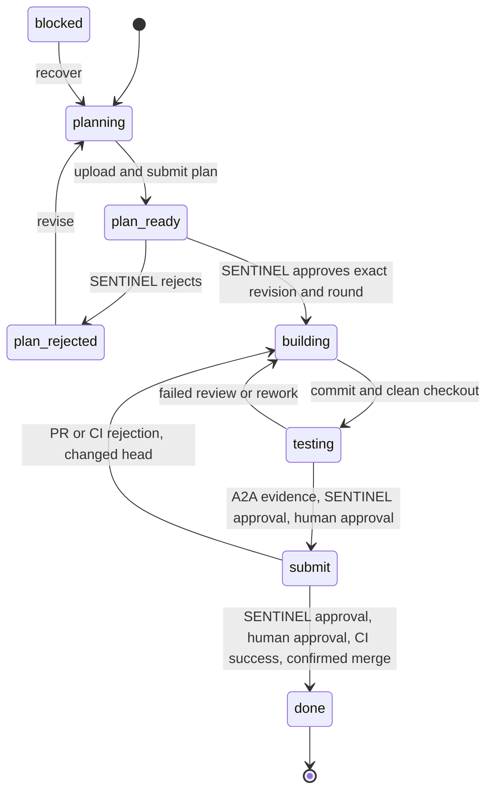
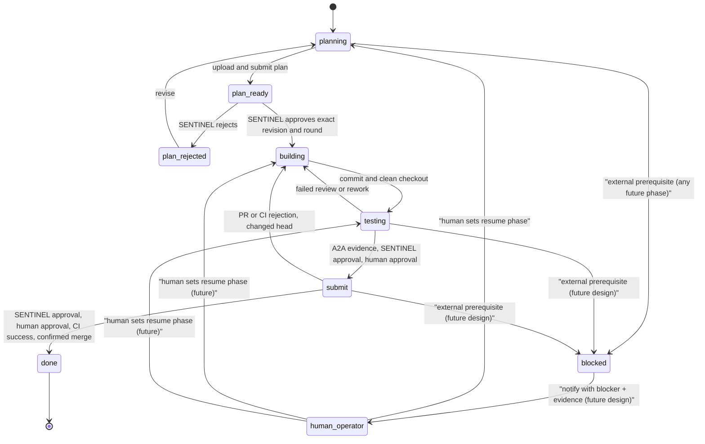

## System Context

OpenFlows runs an agent team across governed workspaces. Each agent has a role:

- NEXUS coordinates assignment, routing, and recovery.
- FORGE plans and builds the change.
- SENTINEL reviews plans, implementation, and verification evidence.
- VESSEL merges only approved and verified work.
- Human operators approve high-trust gates before submission and merge.

The state machine is the shared authority across those roles. It prevents each agent from treating local memory, chat history, GitHub state, or workspace status as the source of truth. Those systems remain projections. The lifecycle record is the control point.

## Lifecycle Graph

## Lifecycle Phases

### Planning

Planning is the entry phase for active work. FORGE converts a ticket into an explicit plan. The plan is not treated as advisory context. It becomes versioned lifecycle data. Any return to planning means the prior downstream evidence is no longer trusted.

### Plan Ready

Plan ready means the plan has been submitted for review. SENTINEL evaluates the plan before implementation begins. This phase separates architectural agreement from code generation. It blocks premature construction and forces design intent to be reviewed while it is still cheap to change.

### Plan Rejected

Plan rejected means SENTINEL found a material issue in the plan. The only forward motion is back to planning. FORGE must revise and resubmit. The system does not allow a rejected plan to drift into implementation through side channels.

### Building

Building begins only after SENTINEL approves a specific plan revision and review round. FORGE implements against that approved plan. Returning to building from a later phase invalidates testing and PR evidence because the candidate artifact has changed.

### Testing

Testing means there is a candidate commit on a clean checkout. SENTINEL can request verification and review the result against the approved plan. The tested head must remain stable. Dirty, missing, stale, changed, or timed-out evidence cannot authorize progress.

### Submit

Submit means the work has passed implementation review and human approval for the testing phase. A pull request can be opened or updated, CI can run, and final submission gates can be evaluated. The submitted head, review round, PR identity, and evidence remain bound together.

### Done

Done is terminal. It requires a confirmed merge, not merely an approved PR, a green local test, or an optimistic GitHub response. The lifecycle records the actual merge outcome so restart recovery can distinguish completed work from pending or ambiguous work.

### Blocked

Blocked is a controlled interruption for nonterminal work. It records that progress cannot continue under current conditions. Today, recovery is driven by FORGE: once the blocker clears, FORGE moves the lifecycle back to planning (`blocked → planning`) because the safest restart point is an explicit re-evaluation of intent and constraints. `blocked` is not terminal; `done` is the only absorbing state.

#### Future design: human-driven recovery

Planned evolution (not yet implemented) routes blocked recovery through a human operator rather than relying on FORGE to self-recover:

- When status is set to `blocked`, the controller notifies a **human operator** with the recorded blocker, exact evidence, and the answerable unblock question.
- The human addresses the underlying issue outside the lifecycle (repairing infrastructure, providing credentials/approval, resolving an external dependency, or correcting the constraint).
- The human then **explicitly sets the next phase** the machine should resume from (typically `planning`, or `building`/`testing` when the blocker was external to the work and downstream evidence remains valid).
- The lifecycle record persists the human's phase directive as an audited, actor-tagged transition, and the system resumes from that phase.

This keeps blocked as a genuine human checkpoint: no autonomous agent advances out of `blocked` on its own. The human decision is recorded in the same versioned lifecycle history as every other transition, so restart recovery can distinguish "blocked and awaiting the operator" from "blocked and resolved." Until this is implemented, the current FORGE-driven `blocked → planning` path remains authoritative.

## Transition Motions

The state machine has three primary motions.

Forward motion advances work only when the required evidence for the current phase exists. Planning moves to plan ready when a plan is submitted. Plan ready moves to building only after SENTINEL approves the exact plan revision and review round. Testing moves to submit only after verification, SENTINEL approval, and human approval. Submit moves to done only after final approval, CI success, and confirmed merge.

Corrective motion sends work backward when evidence fails or becomes stale. Plan rejection returns to planning. Failed implementation review or verification returns to building. PR rejection, CI failure, or a changed submitted head returns to building. These transitions deliberately discard downstream confidence.

Recovery motion handles interruption and ambiguity. Blocked work returns to planning today; in the planned future design a human operator is notified, resolves the issue, and explicitly sets the resume phase before the machine advances. Merge uncertainty does not automatically unlock or retry unsafe operations. The lifecycle preserves reservations and pending deliveries until a safe reconciliation path exists.

## Durable Lifecycle Record

The lifecycle is a typed, versioned record in the shared store. It contains the current phase, plan revision, review decisions, tested head, verification evidence, PR identity, merge identity, history, actor metadata, and transition details.

Each mutation is atomic. A transition compares the observed version with the stored version and replaces the complete record only if it is still current. Concurrent writers cannot both succeed against the same version. Failed writes do not produce partial approval, partial evidence, or implied progress.

This record gives OpenFlows a single coordination surface:

- Agents read the same phase and evidence.
- Humans approve against the same revision and head.
- Recovery reads durable decisions instead of reconstructing intent from logs.
- GitHub state is reconciled against lifecycle state, not treated as the lifecycle itself.

## Evidence Binding

The state machine treats evidence as phase-specific and identity-bound.

A plan approval binds to a plan revision and review round. Testing evidence binds to a candidate head. PR review binds to the submitted head, PR identity, revision, and round. Merge authorization binds to the expected head and completed review delivery.

This prevents stale approvals from authorizing fresh work. If the plan changes, implementation evidence is invalid. If the implementation changes, testing evidence is invalid. If the PR head changes, submit evidence is invalid. Trust moves with the artifact it reviewed, not with the general ticket.

## Human Gates

Human approval is required at the testing and submit boundaries. These gates are part of the lifecycle, not a comment convention. A GitHub approval alone does not replace the lifecycle decision.

The first human gate confirms that implementation and verification evidence are acceptable before the work becomes a submitted PR candidate. The second human gate confirms that the final submitted artifact can be merged after review and CI. This keeps autonomy high while reserving final authority for controlled checkpoints.

## Merge Safety

VESSEL can merge only when all merge prerequisites are present in the lifecycle:

- The submitted head is known.
- CI has succeeded for that head.
- SENTINEL approval is durable.
- Human approval is durable.
- Review delivery is complete.
- GitHub receives the expected head.

A merge reservation prevents concurrent rejection or rework while a merge request is in flight. A definitive rejection releases the reservation. An ambiguous network outcome does not. The system favors operator investigation over unsafe automatic retry when the merge result cannot be proven.

## Recovery Model

OpenFlows assumes crashes, retries, duplicate notifications, stale workspaces, and delayed GitHub responses will happen. The state machine is built so these failures are recoverable without inventing hidden state.

Recovery starts from the durable lifecycle record. If a notification was recorded but not delivered, it can be retried. If a workspace disappears, the current phase identifies what must be rebuilt. If a PR was merged externally, reconciliation can record the outcome explicitly. If evidence is stale, the machine routes back to the phase that can regenerate it.

The important rule is that recovery must never create authority. It may replay delivery, rebuild workers, re-read GitHub, or request new evidence. It cannot manufacture an approval or treat absence of failure as success.

## Design Properties

The OpenFlows state machine has five core properties.

Deterministic progress. Every forward transition has named prerequisites. The next phase is not inferred from chat text or worker intent.

Evidence invalidation. Returning to planning or building clears confidence that depended on older artifacts.

Atomic authority. Versioned compare-and-replace prevents conflicting writers from producing split-brain lifecycle state.

Bounded autonomy. Agents can act independently inside their roles, but lifecycle gates decide when their work becomes authoritative.

Recoverable operation. The record contains enough identity and history to resume, retry, or reconcile without trusting transient process memory.

## Conclusion

The OpenFlows state machine is not only a workflow diagram. It is the safety boundary for autonomous delivery. It defines when work may advance, what evidence must exist, who must approve, and how the system recovers when infrastructure behaves imperfectly.

By making lifecycle state explicit, versioned, and evidence-bound, OpenFlows allows agents to move quickly without allowing local context, stale approvals, or ambiguous external state to become authority.

## Full Lifecycle Diagram

The simplified graph above is the one used for discussion. This full diagram adds the future human-driven `blocked` recovery so a reader can follow the complete flow end to end: when status is set to `blocked`, the controller notifies a human operator, the human addresses the issue, and explicitly sets the next phase from which the system resumes.

The `blocked → human_operator → <resume phase>` path is the planned future design (see the Blocked phase section); until it is implemented, the current FORGE-driven `blocked → planning` transition remains authoritative.
